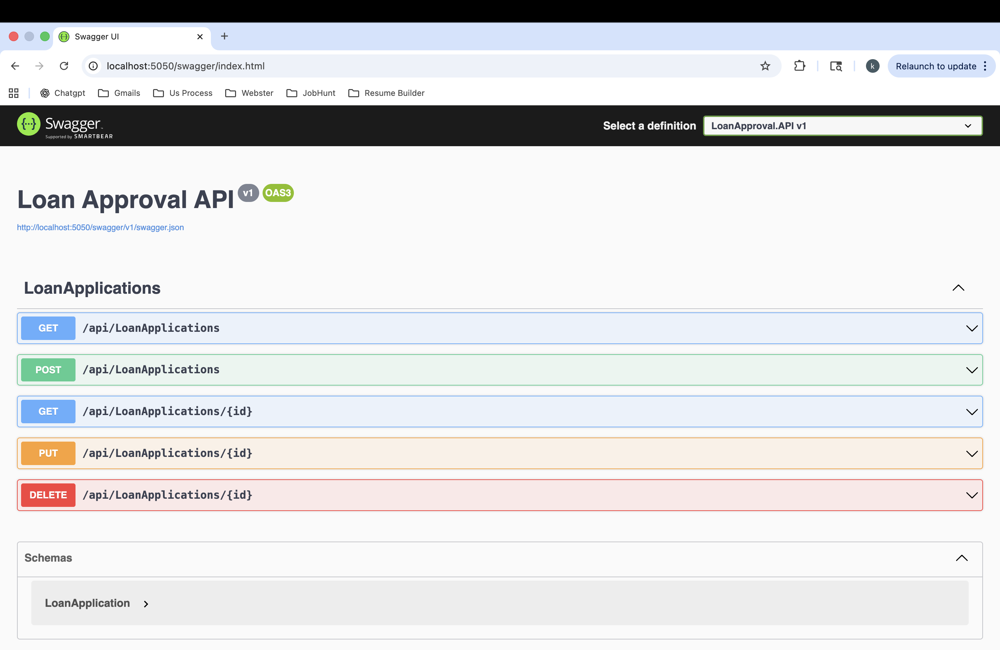
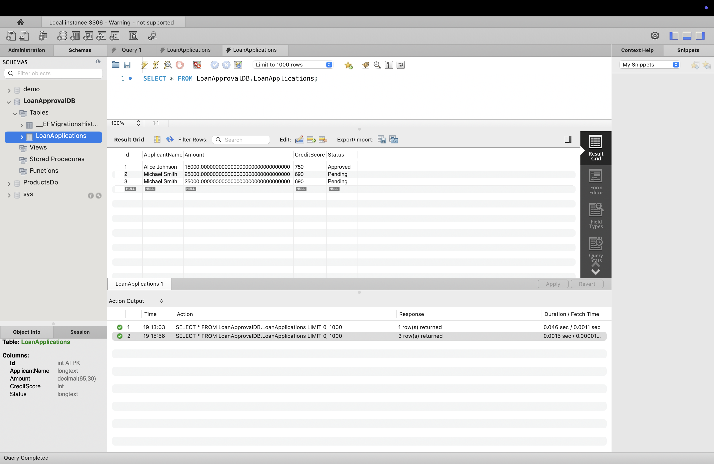

# 🚀 LoanApproval.API

A **Loan Approval Web API** built using **.NET 8**, **Entity Framework Core**, and **MySQL**.  
This project demonstrates the design and development of a RESTful API with full CRUD functionality, Swagger documentation, and real database integration.  
It’s ideal for showcasing your practical full-stack .NET skills to recruiters, clients, and technical reviewers.

---

## 💡 Features
- Full **CRUD** (Create, Read, Update, Delete) operations for managing loan applications
- **Entity Framework Core + MySQL** integration
- **Swagger UI** for API testing and documentation
- **RESTful** and scalable architecture
- Built and tested on **macOS** using **Visual Studio 2022** and **.NET 8**
- Proper error handling and structured responses

---

## ⚙️ Technologies Used

| Category | Technologies |
|-----------|--------------|
| **Backend** | ASP.NET Core 8 Web API, C# |
| **Database** | MySQL 8.0 |
| **ORM** | Entity Framework Core (Pomelo Provider) |
| **Documentation** | Swagger / Swashbuckle |
| **Dev Tools** | Visual Studio 2022, MySQL Workbench, Postman |
| **Version Control** | Git & GitHub |

---

## 🧱 Project Architecture

LoanApproval.API/
│
├── Controllers/
│ └── LoanApplicationsController.cs # API endpoints for CRUD operations
│
├── Data/
│ └── AppDbContext.cs # Database context and configuration
│
├── Models/
│ └── LoanApplication.cs # Entity model representing loan data
│
├── Migrations/ # EF Core migration files
│
├── appsettings.json # MySQL connection configuration
├── Program.cs # Main entry point with service configuration
├── LoanApproval.API.csproj # Project file and dependencies
└── README.md # Project documentation

---

## 🧠 API Endpoints

| Method | Endpoint | Description |
|--------|-----------|-------------|
| GET | `/api/LoanApplications` | Retrieve all loan applications |
| GET | `/api/LoanApplications/{id}` | Retrieve a single loan by ID |
| POST | `/api/LoanApplications` | Create a new loan application |
| PUT | `/api/LoanApplications/{id}` | Update an existing loan |
| DELETE | `/api/LoanApplications/{id}` | Delete a loan application |

---

## 🧾 Example Request (POST)

{
  "applicantName": "John Doe",
  "amount": 25000,
  "creditScore": 710,
  "status": "Pending"
}

✅ Example Response:

{
  "id": 1,
  "applicantName": "John Doe",
  "amount": 25000,
  "creditScore": 710,
  "status": "Pending"
}

🧩 How to Run the Project Locally
1️⃣ Clone the Repository
git clone https://github.com/SSkrishna0909/LoanApproval.API.git
cd LoanApproval.API/LoanApproval.API

2️⃣ Configure the Database

Open appsettings.json and update the MySQL connection string:

{
  "ConnectionStrings": {
    "DefaultConnection": "server=localhost;port=3306;database=LoanApprovalDB;user=root;password=YourPassword;"
  }
}

3️⃣ Apply Database Migrations
dotnet ef database update

4️⃣ Run the API
dotnet run --urls "http://localhost:5050"

5️⃣ Open Swagger UI

Once running, navigate to:

http://localhost:5050/swagger

You can now test all the endpoints directly from Swagger!

🧰 Testing Endpoints with Swagger

POST /api/LoanApplications → Create a new loan

GET /api/LoanApplications → View all loans

GET /api/LoanApplications/{id} → View a specific loan

PUT /api/LoanApplications/{id} → Update loan status or details

DELETE /api/LoanApplications/{id} → Remove a loan record

🧩 Future Enhancements

Add JWT Authentication & Authorization

Implement Role-based access (Admin, User)

Create Frontend UI using Angular or React

Deploy API on Azure App Service or AWS Elastic Beanstalk

Add Unit Tests using xUnit / NUnit

Integrate CI/CD pipeline with GitHub Actions

📸 Screenshot

Add a screenshot of your Swagger UI here 👇

👨‍💻 Author

Swaraj Krishna Samudrala
Full Stack .NET Developer | C# | ASP.NET Core | Entity Framework | MySQL | Azure
🔗 LinkedIn

📧 your.email@example.com

📜 License

This project is open source and available under the MIT License.